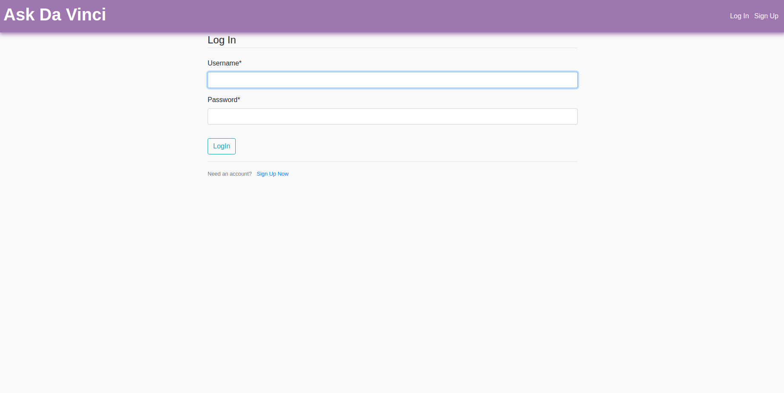
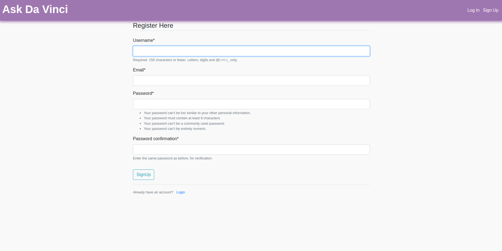
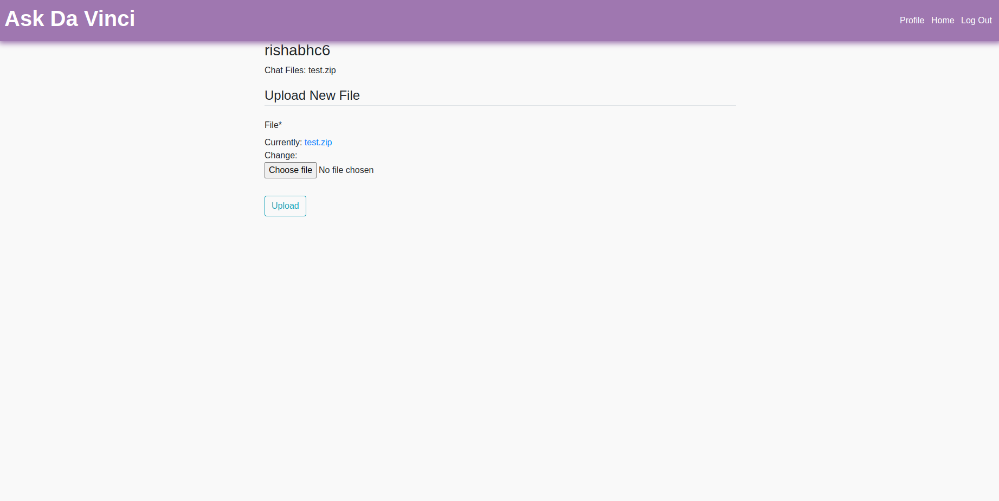
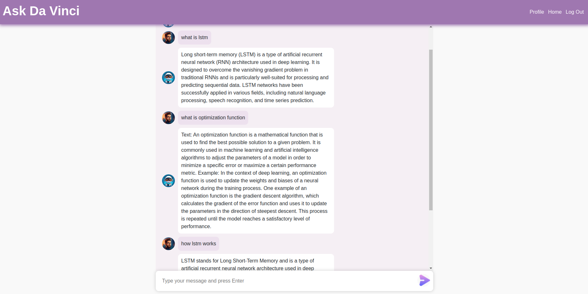

# Query the Documents

## Dependencies

* You will need to install the poetry to install the dependencies.
* You will need need to add OpenAI api key as environment variable **OPENAI_API_KEY**.
* After installing poetry clone the repositry and go inside the repo folder.
* Activate the virtual environment using **poetry shell** command.
* Run **poetry install** to install the dependecies.

## Run the Application

* To run the application run **python manage.py runserver** command.
* You will see below view to login or create account.

</img>
<!--  -->

* Signup with username, email and password for the first time use.

</img>

* By default it will use test.zip file for the new user available under **media/** folder.
* You can change the file from the profile view.
* Got to profile and upload zip file that contains the files for quering.
* For now only .html files are suported. Other formats are in progress...

</img>

* After uploading the file, wait for the file to be processed, then you can start chatting with the files you uploaded.

</img>